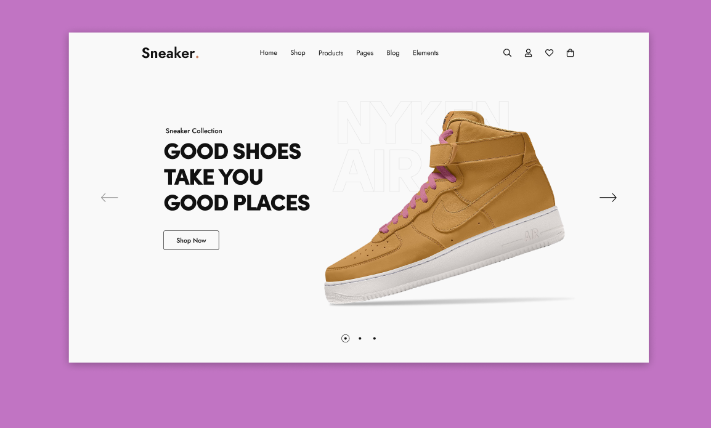

# SNEAKER PROJECT

***Website  design  project***

<br>




<br>

## :bulb: About Project

This project is for educational porpuses only. The main goal of this project is to create a simple website about Sneaker design page!    

>Site published at: https://silvijaz.github.io/Sneaker-project/

>Design: [Sneaker design page] https://www.figma.com/community/file/1282989996438463973/sneaker-hero-section

## :dart: Project Features and Goals

- Github pages
- Html
- CSS
- Basic design layout
- Image with relative paths
- **No responsive design**


## :wink: Getting Started

> What tools to use? It's very simple! **You need to follow these steps:**

Node.js - _download and install_

```
https://nodejs.org
```

Git - _download and install_

```
https://git-scm.com
```

## :running: Would you like to run this project locally?

Open terminal and follow my instruction:


1) Clone repository:

```
https://github.com/SilvijaZ/Sneaker-project
```

2) Install NPM packages:

```
npm i or npm install 
```
> [!NOTE]
Choose one of them. They are same commands. 

3) Run the server:

```
npm run dev
```

## :wave: Authors

Silvija: [Github link](https://github.com/SilvijaZ)

## :warning: License

Distributed under the ISC License.

## :link: Others resources

No other resources.